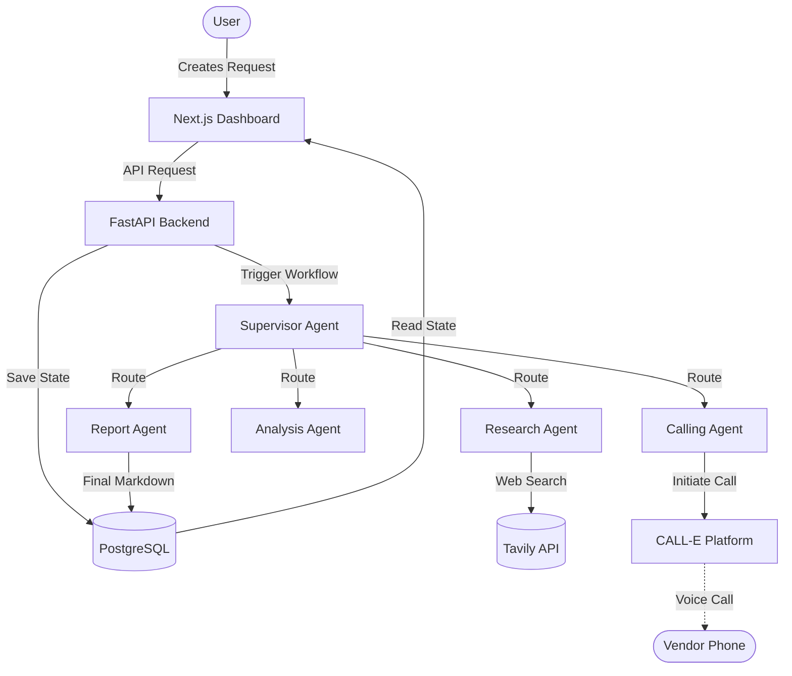

# VenAI: Autonomous AI Procurement Orchestration System

VenAI is a multi-agent system that automates the end-to-end business procurement process. From finding vendors on the internet to calling them via AI-generated voice agents, and finally generating an executive comparison report.

Built during a hackathon, VenAI demonstrates the power of autonomous AI agents interacting with the physical world through telephony.

## Core Features

- **Multi-Agent Orchestration**: A `LangGraph` state machine coordinates a Supervisor Agent, Research Agent, Calling Agent, Analysis Agent, and Report Agent.
- **Automated Web Research**: Integrates with Tavily to scrape and discover relevant vendors based on procurement requirements.
- **AI Voice Calling (CALL-E Integration)**: Leverages the CALL-E platform to automatically call vendors, converse in natural language, negotiate prices, and extract structured offers directly from transcripts.
- **Omnichannel Fallback**: If a call fails (e.g., due to region blocks or busy lines), VenAI drafts automated WhatsApp and Email messages with context-aware deep links (`wa.me/` and `mailto:`).
- **Beautiful Modern Dashboard**: Built with Next.js, TailwindCSS, and Clerk for authentication.

## System Architecture

## Hackathon Demo Scenario

1. **Create a Procurement Request**: The user logs in and creates a request (e.g., "500 Office Chairs", Budget: $50000).
2. **Vendor Discovery**: The AI searches the web for relevant vendors and adds them to the request, extracting phone numbers and emails.
3. **Run AI Agent Workflow**: The user clicks "Run Agent Workflow". 
4. **Automated Calls**: The background LangGraph worker starts. The Calling Agent dials the vendors using CALL-E. It asks for pricing and availability.
5. **Analysis & Reporting**: The agent system analyzes the extracted data from the calls and generates a final Markdown executive summary, highlighting the best vendor choice.
6. **Omnichannel Fallback Display**: For vendors that couldn't be reached by phone, the dashboard provides 1-click fallback buttons to instantly send a drafted WhatsApp or Email message.

## Setup Instructions

### Backend (FastAPI)

1. `cd server`
2. Create virtual environment: `python -m venv venv`
3. Activate: `.\venv\Scripts\activate` (Windows) or `source venv/bin/activate` (Mac/Linux)
4. Install dependencies: `pip install -r requirements.txt` (Ensure `fastapi`, `uvicorn`, `langgraph`, `langchain-google-genai` are installed)
5. Setup `.env` (needs `DATABASE_URL`, `GEMINI_API_KEY`, `TAVILY_API_KEY`, `CALLE_API_KEY`, etc.)
6. Run migrations: `alembic upgrade head`
7. Start server: `uvicorn app.main:app --reload`

### Frontend (Next.js)

1. `cd client`
2. Install dependencies: `npm install`
3. Setup `.env.local` (needs `NEXT_PUBLIC_CLERK_PUBLISHABLE_KEY`, `CLERK_SECRET_KEY`, `NEXT_PUBLIC_API_URL`)
4. Start dev server: `npm run dev`

## Tech Stack
- Frontend: Next.js App Router, React, Tailwind CSS, Lucide Icons, Sonner.
- Backend: FastAPI, SQLAlchemy (AsyncPG), LangGraph, Langchain.
- Database: PostgreSQL.
- External APIs: Clerk (Auth), CALL-E (Voice calls), Tavily (Search), Gemini 2.5 Flash (LLMs).
